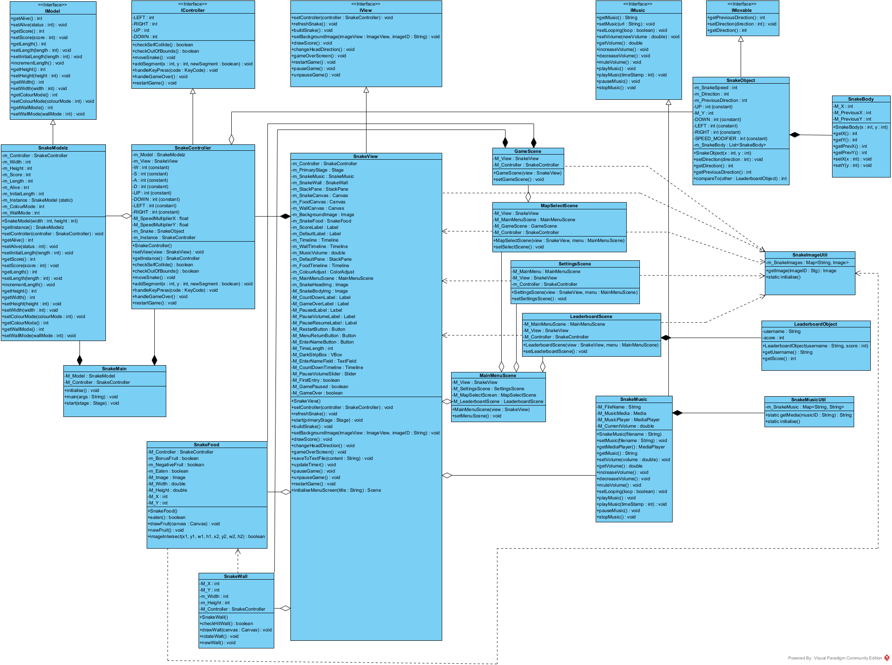
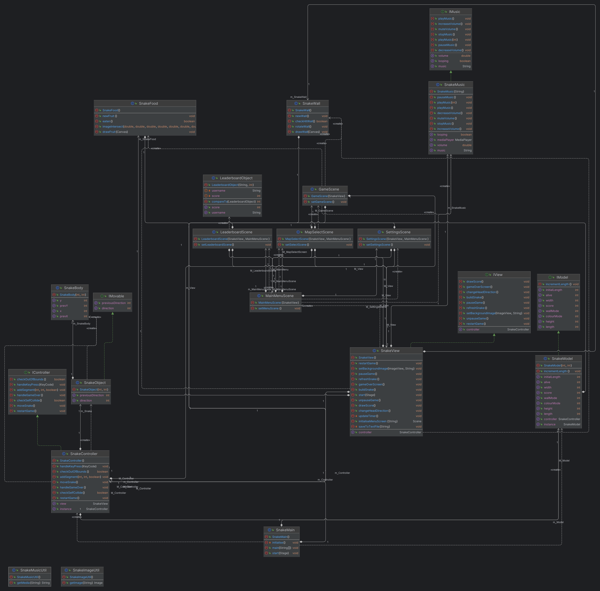

[Back to README](../README.md)\
\
\
[<-- Initial Notes on Structure](notesOnStructure.md)\
[Coding Conventions -->](codingConventions.md)

## Class Diagram
### Initial Structure of Program

### IntelliJ Automatic Class Diagram

## New Diagrams
### Class Diagram

### Updated IntelliJ Automatic Class Diagram

### Activity Diagram
I decided to make a activity diagram as the program has alot of menus and I felt it was
appropriate to have a diagram to refer to when using the program, to see what causes what.
This makes it easier to use the program and to see what links to what, and what causes what.
